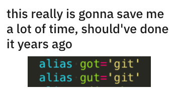

> Sorry, no Windows instructions as I don't use Windows. Use Google if that's the OS you use.

I found a funny post on Reddit that highlights how we, as developers, can lose productivity over the small things, like typos:



I don't have this set up, as I mostly use a GUI for Git (GitHub Desktop). But I use other aliases. Most notably `ll` instead of `ls -al`.

How do I set up an alias in the terminal?

> Also check my guides [how to use the macOS terminal](https://flaviocopes.com/macos-terminal/), [the Bash shell](https://flaviocopes.com/bash/) and the [Bash scripting tutorial](https://flaviocopes.com/bash-scripting/).

I said macOS in the title, but this works also on Linux of course.

Here's the syntax:

```sh
alias <newcommand>='<old command>'
```

Here's the example I mentioned above:

```sh
alias ll='ls -al'
```

This works in Bash, Zsh, [Fish shell](https://flaviocopes.com/fish-shell/) and others too.

If you write this in your shell, from now on `ll` will be a new available command in the console.

Note: this alias is going to be valid for the entire **session**, which means until you close the shell, or you restart the computer, whatever comes first.

To **persist** the aliase, so you can use them any time in the future, you need to add it to the configuration file for your shell.

If you use Bash, that's the `.bash_profile` in your home folder. It's an invisible file, so you might need to open it with the terminal rather than the Finder:

```sh
code ~/.bash_profile
```

> `~` always points to your home folder path

(assuming you have [Visual Studio Code](https://flaviocopes.com/vscode/) installed, which provides the `code` command).

If `~/.bash_profile` does not exist, you can create it, and the shell will pick it up. You can also use the `~/.bashrc` file, if present.

For licensing purposes, macOS **Catalina** comes with a new shell by default, called **Zsh**. In this case, the configuration file is in the `~/.zshrc` file, still in your home folder.

```sh
code ~/.zshrc
```

The fish configuration is stored in `~/.config/fish/config.fish`, but you'll most likely configure it via the `fish_config` command.