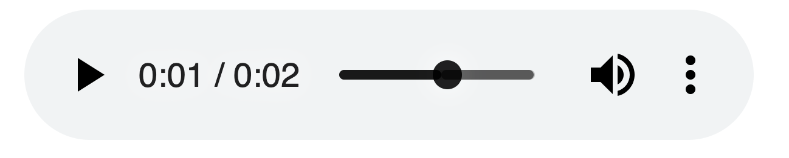

The `audio` tag allows you to embed audio content in your HTML pages.

This element can stream audio, maybe using a microphone via [`getUserMedia()`](/getusermedia/), or it can play an audio source which you reference using the `src` attribute:

```html
<audio src="file.mp3" />
```

By default the browser does not show any controls for this element. Which means the audio will play only if set to autoplay (more on this later) and the user can't see how to stop it, or control the volume or move through the track.

To show the built-in controls, you can add the `controls` attribute:

```html
<audio src="file.mp3" controls />
```

Controls can have a custom skin.

You can specify the MIME type of the audio file using the `type` attribute. If not set, the browser will try to automatically determine it:

```html
<audio src="file.mp3" controls type="audio/mpeg" />
```

An audio file by default does not play automatically. Add the `autoplay` attribute to play the audio automatically:

```html
<audio src="file.mp3" controls autoplay />
```

> Note: mobile browsers don't allow autoplay

The `loop` attribute restarts the audio playing at 0:00 if set, otherwise if not present the audio stops at the end of the file:

```html
<audio src="file.mp3" controls autoplay loop />
```

You can also play an audio file muted using the `muted` attribute (not really sure what's the usefulness of this):

```html
<audio src="file.mp3" controls autoplay loop muted />
```

## CORS

Audio is subject to [CORS](https://flaviocopes.com/cors/) and unless you allow it on the server side, an audio file can't be played cross-origin.


## Preloading the audio

If you don't set `autoplay`, the spec says that browsers will only download the audio metadata (to find out the length, for example) but will not download the audio itself.

You can force preloading the audio using

```html
<audio src="song.mp3" preload="auto" />
```

## Displaying content if `audio` is not supported

The `audio` tag is [very well supported](https://caniuse.com/#feat=audio), up to IE9, so nowadays there should be no need to have a placeholder text, but we have this option. You just add a closing tag, and insert text between the opening and closing tag:

```html
<audio src="song.mp3">Audio tag not supported</audio>
```

## Adding native controls

Instead of autoplaying the audio in the background, you can choose to ask the browser display a set of controls to let the user play the audio when they want, have some indication of the length, set the volume and let them navigate the track:

```html
<audio src="song.mp3" controls />
```

This is how it looks in Chrome:



You can style controls using CSS, although this is out of the scope  for this introduction.

## Adding multiple sources

Browsers can implement one audio codec but not another. Maybe you want to use a newer standard which cuts file size in half but you still want to support older browsers.

You do so with the `source` tag:

```js
<audio controls>
 <source src="song.opus" type="audio/ogg; codecs=opus"/>
 <source src="song.ogg" type="audio/ogg; codecs=vorbis"/>
 <source src="song.mp3" type="audio/mpeg"/>
</audio>
```

## Working with audio events

We can listen for events on each `audio` element using JavaScript, to create interesting projects and interfaces. There is a lot of different events to play with.

The `play` event is fired when the audio playback starts:

```js
document.querySelector('video').addEventListener('play', () => {
  alert('Audio is playing!!!')
})
```

You can also directly add this event (as the others) using the `on<event>` attribute directly on the HTML element:

```html
<audio src="song.mp3" controls onplay="playing()" />
```

```js
const playing = () => {
  alert('Audio is playing!!!')
}
```

These are a few events you can listen to:

- `play` audio started playing
- `pause` audio was paused
- `ended` audio playing completed
- `timeupdate` the user interacted with the playback timeline and went forward/backwards
- `volumechange` the user changed the volume

There are a lot more events related to the audio loading, and [you can find the full list on MDN](https://developer.mozilla.org/en-US/docs/Web/HTML/Element/audio#Events).
