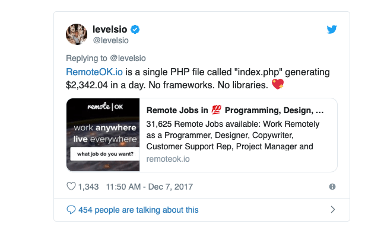

Until a few months ago I could not even look at JavaScript without having a feeling of anxiety.

I was 100% under the so-called JavaScript Fatigue and I could not get out of it.

This lasted years.

Today, I love JavaScript and its ecosystem.

*How did this happen?*

I've been using JavaScript in some form or another since the nineties, and I have some books on my shelf that looks very funny today, full of `document.write` statements.

It was probably 2012-2013, the huge changes that ES6 would bring us were all over the place.

At first, I could not pick up all the things that were going on. I could not accept so many changes all at once. JavaScript was changing but I was resistant. It took me so much to learn it properly, and it was changing under my feet.

I found a really *spot on* comment made on a blog post when it argued that "*learning modern JavaScript was tough if you haven't been there since the beginning*":

> I would argue being there since the beginning (yes, I'm *that* old) makes it even tougher  -  Tim Tate

I dived into JavaScript and Node.js seriously in 2012, and I had never experienced a language change so incredibly huge as ES6. The previous big change happened in 2009 with ES5. ES6 literally changed everything. It was such a huge revamp of JavaScript that every day you had so many things that could get into that spec but you didn't really know if they made it, and you had to catch up as everyone on Twitter was talking about those things that maybe were the next big thing.

`var` was left in the dust.

`function` does not exist anymore.

Prototype-based inheritance, which took a long time to learn properly, is gone, hidden under the 🌈 carpet of classes.

This was just the surface. The whole JavaScript ecosystem has hugely changed in the last few years.

## Build all the things

One big shift that was happening was **building**.

We went from a very simple thing, including our JavaScript with script tags, to having build steps that compile our language to some incomprehensible huge file. At first I resisted strenuously, I got up in my tower fully armed with cannons to fight the build army.

But when the Babel forces came along, I initially fought even harder but in the end I raised the white flag, and I **joined the enemy**.

I realized Babel is not some fancy library that introduces future, edge features, and when those land in the browser we'll forget Babel. No, Babel is here to stay, for the foreseeable future.

When ES2017 will fully land in the browser, Babel will allow for ES2018, ES2019 and so on. There's no escape. Embrace the future, Babel is your friend.

## Use the simplest alternatives

The tooling is one of the hardest parts of JavaScript nowadays. Yes, you can learn all about Webpack but when you start out, ignore everything, and use ready-made solutions like [create-react-app](/react-create-react-app/), the React Boilerplate will hide the tiny details for you and let you focus on the code.

Don't start by setting up an environment, learn by using [Glitch](/glitch/). There's no simpler way to start diving into modern JavaScript.

## No more huge releases

ES6 was so big that the ECMAScript committee decided to do smaller releases next time. This is why ES6 is also called ES2015, and was the first release with the year- we'll have a yearly release from now on. It's easier to catch up, will have less changes as the time to add them is limited, and it's predictable (keep in mind though, there will be change).

## Ignore the buzz

If you're like me, you might follow a lot of people on Twitter that are always on the edge. Maybe some thought leaders that dictate what's the next big thing. They say to use X, everyone else uses X.

Maybe they like to show their snippets using the latest APIs which are not even close to being standard, but can be used with a flag in the browser.

They might have a good reason. You do not. Don't fall in the trap of the shiny new toys, focus on your work.

## There is not a new framework every week

There is a joke floating around that says "whatever JavaScript framework flavor of the month" or "there's a new library every week". That's true, there is a gazillion people working on JavaScript and this is great, it brings innovation and evolution, the kind JavaScript experienced in the last few years, which were huge for the language ecosystem.

But the thing to note is that the big things do not change much frequently.

React is 6 years old.

Vue is 5 years old.

5 years is a very long time in tech. Those are stable technologies. Learn it now, they are here to stay for a long time, too - they are not going away.

> You have plenty of time to become an expert in any of those frameworks, they are not going to go away anytime soon.

## Accept that things come and go

That said, anything has a lifecycle.

A few years ago jQuery was used everywhere, now rarely do new projects start with it.

In 2013 Backbone.js was huge. Now it has disappeared from the map.
CoffeeScript, removed from the face of earth.

Ember.js, Angular.js, and Meteor rocked and stayed at the top of their popularity for a few years, now the most talked about ones seem to be React, Vue, and Angular (which is different from Angular.js).

Each cycle for those major frameworks usually lasts quite a few years. I still have lots of Ember.js applications running just fine, there is no need to update them if they do their job, and I don't plan to touch them.

> Tech evolves and matures, then it gets used rather than talked about.

## You are not stupid for using jQuery

Some people have a thick skin. But if you read around enough, you will find those that despise the technology that everyone  once used and inform you that you are wrong. 😆

Having used PHP for a long time, I got used to this, it's normal to have people criticizing something popular. Even Go, which is amazing for its simplicity, is sometimes criticized for that. You will always find someone that throws shit at something.

As an example, I have to cite this tweet by Pieter Levels, who built a huge independent business with a single PHP file.

But as a beginner you might find out someone that says you've chosen an old tech, that no one uses it any more, that you should use React instead.
Ignore them, move them out of your mind.

Remember:

> If it works for you, it's the right stack.

Most of the times tech is built from giant companies with needs completely, radically different than yours, or the ones of your small team. Go with what you know and make a difference even without using leading edge technology.

Now, you probably don't need jQuery. But not in the place of a framework - plain JavaScript is super fine.

The other part of the spectrum is over-engineering. Don't use tech just to feel smarter. Know it better. And learn when to use a framework or library that helps you.

## You don't have any obligation to know everything. Find your balance.

While it might sound like it from reading your Twitter feed, **no one knows all the things**. There's no way someone can learn all the stuff that's going on in frontend development. This is a lifetime school. There's absolutely no way to graduate.

## Pick tech with user-friendly documentation

It's not by chance that React and Vue have amazing documentation.
It's a key part of their success.

## JavaScript will evolve again

Last year the ECMAScript language introduced await/async and now that feature of the language is used a lot. Promise-based code simply looks bad, you feel the urge to rewrite everything.

Don't do it, and instead use new features for the new code you write.
The same will happen this year, with ES2018. Everyone will talk about them for a while, then we'll get back to work and we'll start talking about the ES2019 features.

Embrace the change. It's much better than betting on tech that stalls and then fades into being irrelevant in a few years: **JavaScript is here to stay**!

## Learn the basic fundamentals, and pick your own journey

Developing on the Web Platform requires a commitment to learn something new often, even just to find out what's possible.

Sometimes learning in 20% of the time the 80% of the things you will need is enough, without diving too much into the edge cases.

## The journey has just begun

JavaScript is still very young compared to other languages, it's hugely popular and it was able to dramatically change in the last few years. It attracts lots of talented new developers every day, and it's fascinating thinking about the JavaScript we'll write in 10 or 20 years from now.

