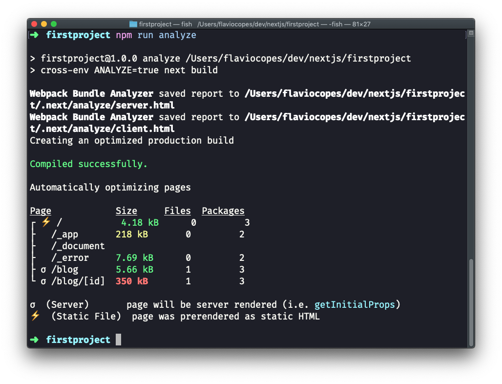
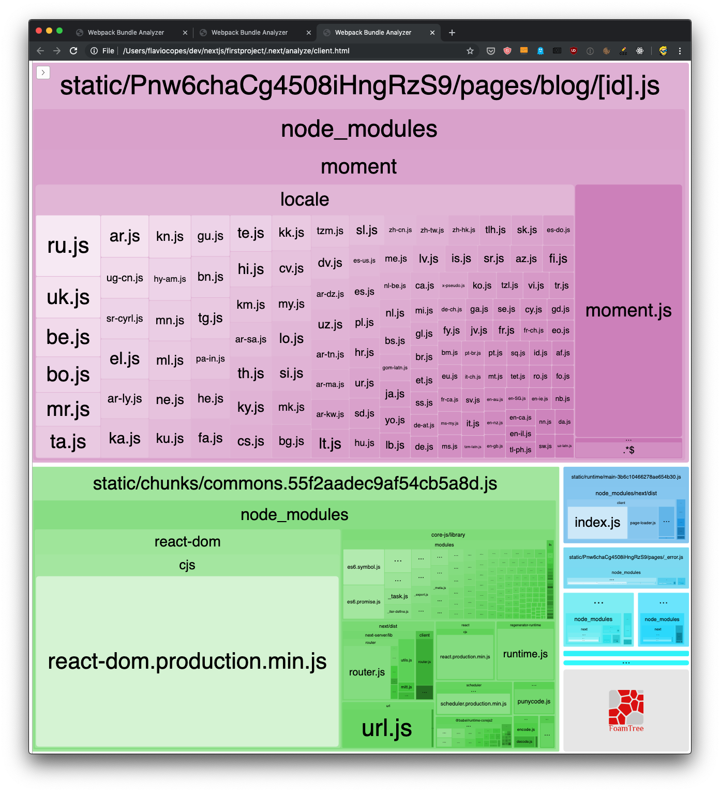
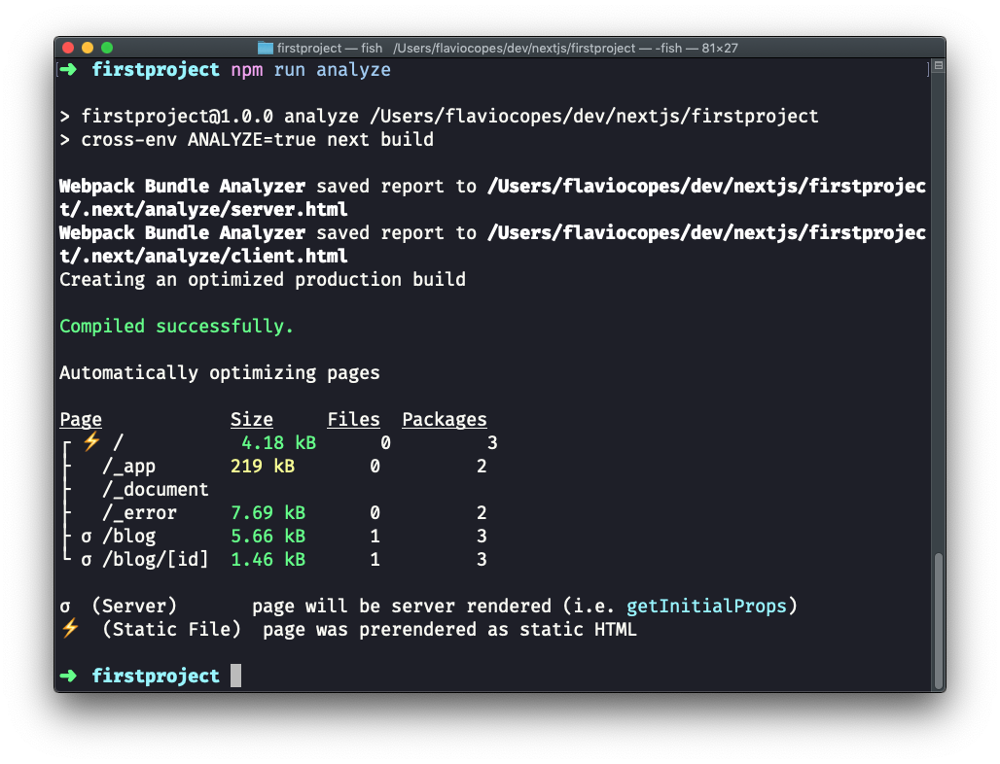

Being able to visually analyze a bundle is great because we can optimize our application very easily.

Say we need to load the Moment library in our blog posts. Run:

```bash
npm install moment
```

to include it in the project.

Now let's simulate the fact we need it on two different routes: `/blog` and `/blog/[id]`.

We import it in `pages/blog/[id].js`:

```jsx
import moment from 'moment'

...

const Post = props => {
  return (
    <div>
      <h1>{props.post.title}</h1>
      <p>Published on {moment().format('dddd D MMMM YYYY')}</p>
      <p>{props.post.content}</p>
    </div>
  )
}
```

I'm just adding today's date, as an example.

This will include Moment.js in the blog post page bundle, as you can see by running `npm run analyze`:



See that we now have a red entry in `/blog/[id]`, the route that we added Moment.js to!

It went from ~1kB to 350kB, quite a big deal. And this is because the Moment.js library itself is 349kB.

The client bundles visualization now shows us that the bigger bundle is the page one, which before was very little. And 99% of its code is Moment.js.



Every time we load a blog post we are going to have all this code transferred to the client. Which is not ideal.

One fix would be to look for a library with a smaller size, as Moment.js is not known for being lightweight (especially out of the box with all the locales included), but let's assume for the sake of the example that we must use it.

What we can do instead is separating all the Moment code in a **separate bundle**.

How? Instead of importing Moment at the component level, we perform an async import inside `getInitialProps`, and we calculate the value to send to the component.
Remember that we can't return complex objects inside the `getInitialProps()` returned object, so we calculate the date inside it:

```js
import posts from '../../posts.json'

const Post = props => {
  return (
    <div>
      <h1>{props.post.title}</h1>
      <p>Published on {props.date}</p>
      <p>{props.post.content}</p>
    </div>
  )
}

Post.getInitialProps = async ({ query }) => {
  const moment = (await import('moment')).default()
  return {
    date: moment.format('dddd D MMMM YYYY'),
    post: posts[query.id]
  }
}

export default Post
```

See that special call to `.default()` after `await import`? It's needed to reference the default export in a dynamic import (see https://v8.dev/features/dynamic-import)

Now if we run `npm run analyze` again, we can see this:



Our `/blog/[id]` bundle is again very small, as Moment has been moved to its own bundle file, loaded separately by the browser.