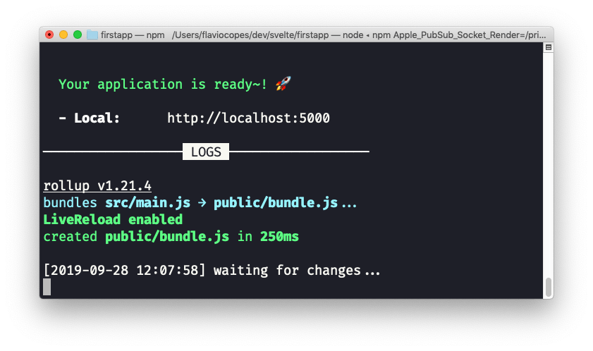
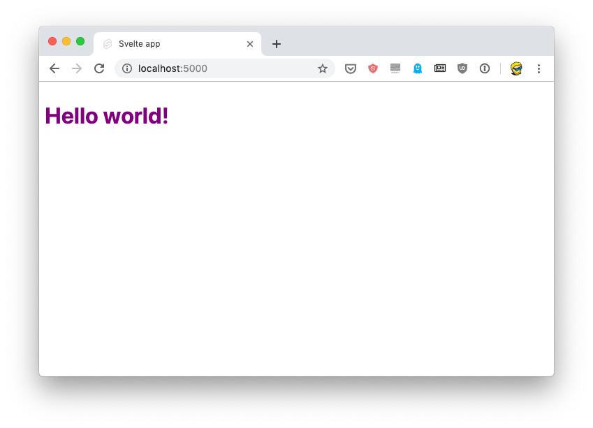
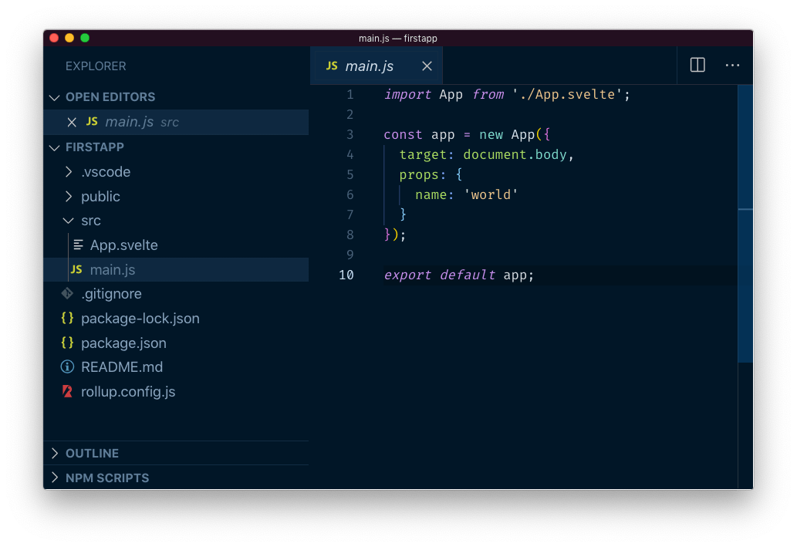

Since I started using Hugo as a static site generator to create websites, I've grown to love this approach to publishing on the web, compared to using a CMS that generated pages dynamically, as I was used to - in the past.

**Svelte** is a JavaScript framework that gives me the same feeling. Compared to React, Vue, Angular and other frameworks, an app built using Svelte is **compiled** beforehand, your site visitors don't have to be served the framework and libraries code, and as a result all the fruition of the experience is smoother, consumes less bandwidth, and everything feels faster and lightweight.

As with Hugo, which disappears at deployment and generates plain HTML, Svelte disappears and all you get is plain JavaScript.

But let's jump to the meat of the article. How to get started with Svelte.

You need to have Node.js installed. Check out my [how to install Node.js](/node-installation/) post if you don't have it already!

And make sure it's the latest version ([how to update Node.js](/how-to-update-node/)).

Node installs the [`npx`](/npx/) command, which is a handy way to run Node commands. In particular we're going to run this:

```sh
npx degit sveltejs/template firstapp
```

This will download and run the [degit command](https://github.com/Rich-Harris/degit), which in turn downloads the latest code of the Svelte project template living at [https://github.com/sveltejs/template](https://github.com/sveltejs/template), into the `firstapp` folder.

Now go into that `firstapp` folder and run `npm install` to download the additional dependencies of hte template. At the time of writing, those are the dependencies of that project template:

```
"npm-run-all"
"rollup"
"rollup-plugin-commonjs"
"rollup-plugin-livereload"
"rollup-plugin-node-resolve"
"rollup-plugin-svelte"
"rollup-plugin-terser"
"svelte"
```

As you can see, it's the Svelte core, plus [Rollup](https://rollupjs.org/) (a Webpack alternative) and some of its plugins. Plus [`npm-run-all`](https://www.npmjs.com/package/npm-run-all), a CLI tool that is used to run multiple npm scripts in parallel, or sequential.

We're now ready to run our Svelte site in development mode, by running

```sh
npm run dev
```

This will start the app on localhost, on port 5000, by default:



If you point your browser there, you'll see the "Hello world!" example:



You're now ready to open the code in your favorite editor. The `src` folder contains all you need to tweak the app: the `main.js` file:



This file is the entry point and in this case initializes the App component, which is defined in `App.svelte`, a single file component:

```html
<script>
export let name;
</script>

<style>
h1 {
color: purple;
}
</style>

<h1>Hello {name}!</h1>
```

If you are familiar with [Vue.js](https://flaviocopes.com/tags/vue/), it's a similar concept. You define the markup, the style and the JavaScript for each component in a single `.svelte` file.

> More on Svelte coming soon!