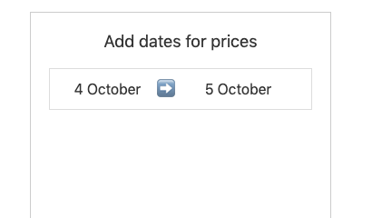
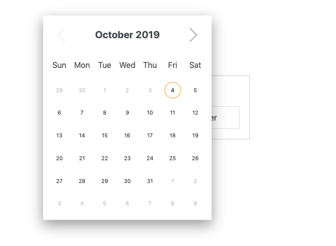
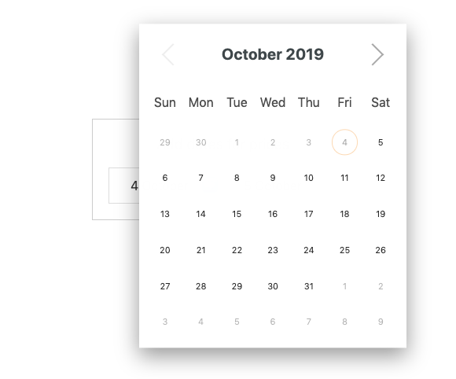
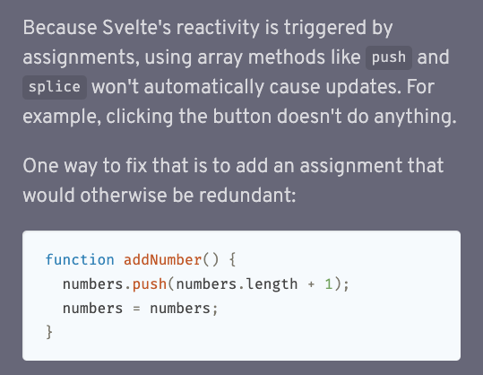

Yesterday I had this problem: I was using a Datepicker Svelte component - 2 instances of it.

Just to give you more context, I want to set a starting date, and an ending date:



When you clicked the starting date, the date picker showed up:



When you clicked the ending date, the second date picker showed up:



Now the problem was that based on the starting date, the end date had some constrains. For example, a logical one was that you can't set an end date that's prior to the starting date.

The date picker component exposed a `selectableCallback` function prop, called when the component is first rendered, running for all the dates in the calendar, allowing me to return false on some dates to disable them.

```html
<script>
let endDateSelectableCallback = date => {
  //TODO: decide if date is ok
}
</script>

<Datepicker
selectableCallback={endDateSelectableCallback
}>
```

Sounds great!

Except this function only ran when the component was rendered the first time.

I needed a way to re-run that function when the _other_ component changed its value. So I could remove all dates prior to the starting date selected. Also, it had to run multiple times as the user could change idea.

So.. when selecting a date on the other component, I used the `on:dateSelected` event to just reassign the function I assigned to `selectableCallback`, called `endDateSelectableCallback`, to itself.

```html
<script>
let endDateSelectableCallback = date => {
  //TODO: decide if date is ok
}
</script>

<!-- first date picker, start date -->
<Datepicker on:dateSelected={e => {
  endDateSelectableCallback=endDateSelectableCallback;
}}>
selectableCallback={endDateSelectableCallback
}>

<!-- second date picker, end date -->
<Datepicker selectableCallback={endDateSelectableCallback
}>
```

This might not be the most idiomatic Svelte code and I could probably add a `refresh={refreshComponent}` prop instead.  But maybe it is idiomatic, since the Svelte docs also mention adding a redundant assignment to trigger a re-render when we update a value:



I think that this is a very specific pattern that might not be very common. I haven't encountered this problem before, as far as I remember, so I'm happy with this solution so far - it works.